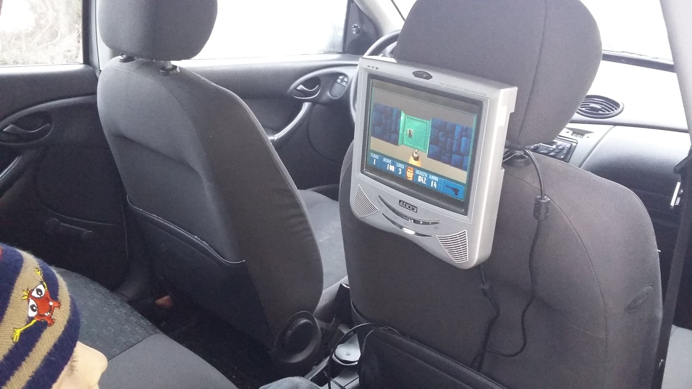

# Emulation-Station

This project can be done on a Raspberry Pi running Emulation Station, besides the possibility of runing ROMs for multiple
retro consoles, the more interesting part of this project is the installation of a steam link like client for streaming games
over a LAN.

Help with transfering roms using SFTP to the system can be found [here.](https://github.com/retropie/retropie-setup/wiki/Transferring-Roms)

In this case the streaming is done using Moonlight, an open source Nvidia GameStream client, note that this project only
works if you have an nvidia graphics card on your PC.

Moonlight for Emulation Station can be installed with wget using [this script.](https://raw.githubusercontent.com/TechWizTime/moonlight-retropie/master/moonlight.sh)

Using this build I managed to have some fun playing video games that I used to play on my first Pentium computer as a kid,
  I was also able to run it in my father's car by connecting the Raspberry Pi to a 12v screen.

